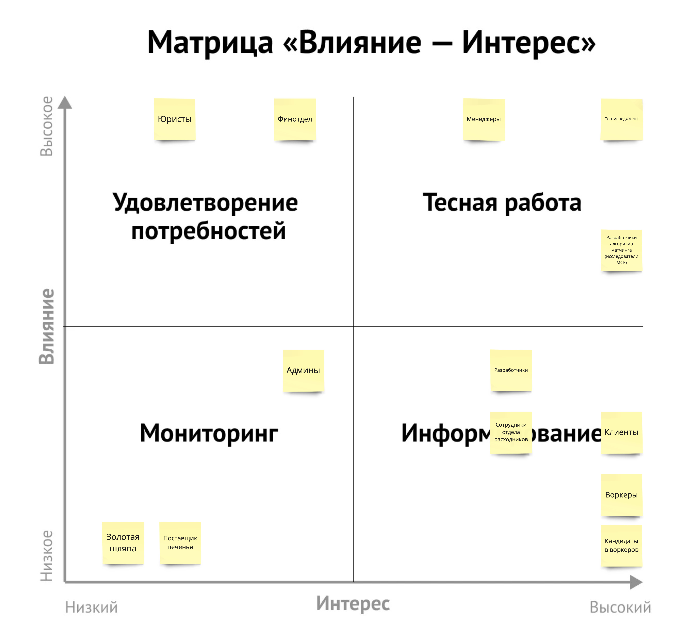
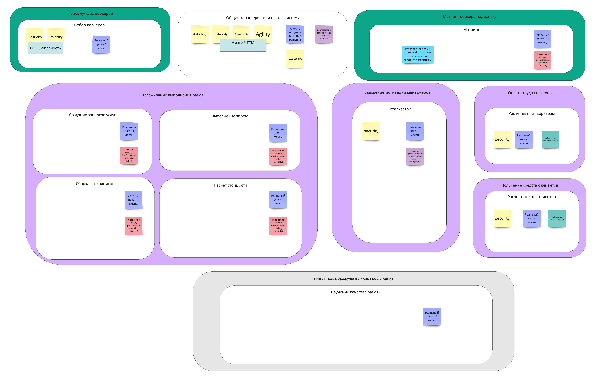
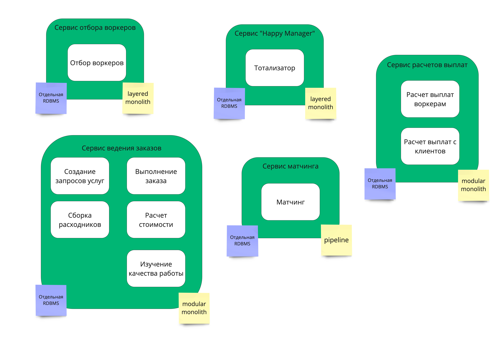
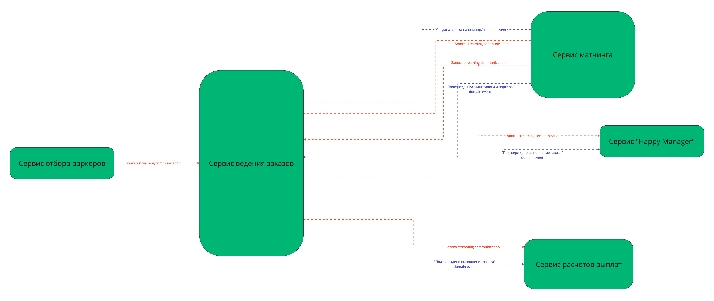

## Стейкхолдеры

- Топ-менеджмент
- Менеджеры
- Финотдел
- Разработчики
- Админы
- Юристы
- Клиенты
- Кандидаты в воркеров
- Воркеры
- Сотрудники отдела расходников
- Поставщик печенья
- Золотая шляпа
- Разработчики алгоритма матчинга (исследователи MCF)

## Разбивка стейкхолдеров по группам

## Архитектурный стиль

Для системы выбран распределенный стиль, т.к.:
- для разных ограниченных контекстов есть достаточно отличающиеся характеристики, которых проще достичь в рамках разных сервисов
- нет ограничений по стоимости системы
- нет ограничений на инфраструктуру

### Характеристики отдельных ограниченных контекстов

### Разбивка ограниченных контекстов по сервисам

|Название сервиса|Ограниченные контексты|Причина вынесения в сервис|Архитектурный стиль сервиса|БД для сервиса|
|---|---|---|---|---|
|Сервис отбора воркеров|"Отбор воркеров"|к сервису есть отдельные требования по возможности DDOS-а - см. `[US-81]` + отдельные требования по TTM - 1 релиз в неделю|`layered monolith` как стиль "по умолчанию"|из-за бесплатности инфраструктуры выбран вариант с отдельной RDBMS|
|Сервис "Happy Manager"|"Тотализатор"|к сервису есть отдельные требования по безопасности, вплоть до нераскрытия кода для других разработчиков и необходимости избежать маски-шоу. Обеспечить это в рамках одного монолита это очень сложно|`layered monolith` как стиль "по умолчанию"|из-за требований безопасности (потенциально необходимо уничтожить данные) + бесплатности инфраструктуры выбран вариант с отдельной RDBMS|
|Сервис расчетов выплат|"Расчет выплат воркерам" и "Расчет выплат с клиентов"|из-за требований CatFinComplience, которые проще обеспечить в рамках отдельного сервиса, либо потребует наложить ограничения на всю систему|`modular monolith` из-за необходимости поддержания разделения доменной логики (несколько ограниченных контекстов в одном сервисе)|из-за требований по CatFinComplience + бесплатности инфраструктуры выбран вариант с отдельной RDBMS|
|Сервис матчинга|"Матчинг"|из-за требований `[US-300]`, где разработчики хотят выбирать язык реализации самостоятельно + специфичности алгоритма - map-reduce)|`pipeline` из-за того, что логика алгоритма будет напоминать последовательность шагов (а-ля map-reduce)|из-за бесплатности инфраструктуры выбран вариант с отдельной RDBMS|
|Сервис ведения заказов|все остальные - "Создание запросов услуг", "Выполнение заказа", "Сборка расходников", "Расчет стоимости", " Изучение качества работы"||`modular monolith` из-за необходимости поддержания разделения доменной логики (несколько ограниченных контекстов в одном сервисе)|из-за бесплатности инфраструктуры выбран вариант с отдельной RDBMS|

## Коммуникация между сервисами

Для всех коммуникаций между сервисами был выбран асинхронный стиль коммуникаций из-за:
- под вопросом DDOS в сервисе отбора воркеров (оттуда точно асинхронный)
- бесплатности инфраструктуры
- недостаточной проработанности с моей стороны модели данных и ES, много чего не вижу сейчас :smile:

