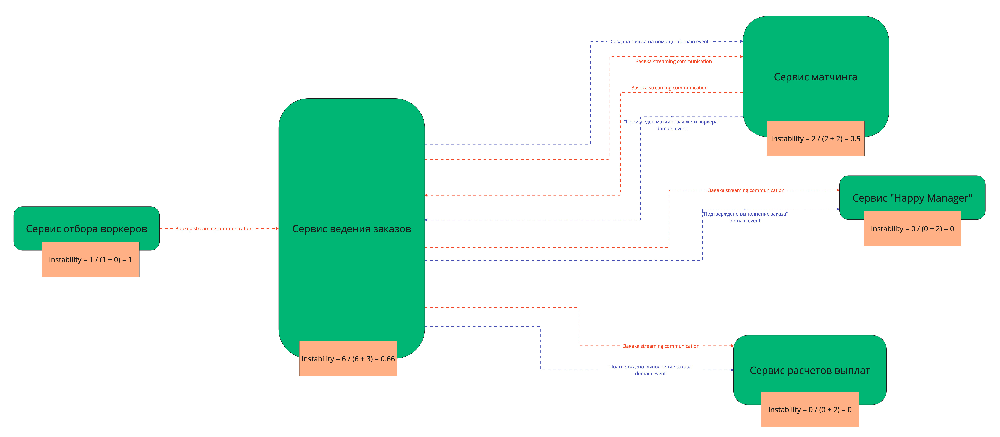

# Четвертая домашка

В нулевой домашке у меня был выбран монолит как вариант для реализации системы.

Буду брать его за стартовую точку.

Расчет instability для финального распределения по сервисам

## План распила монолита (когда свободных людей и ресурсов нет, а опыт и (или) инфраструктура есть)

В этой ситуации начинаем распил с самых ответственных поддоменов.

План распиливания такой:
1. сервис отбора воркеров (самый ответственный, плюс самый нагруженный)
2. сервис матчинга
3. сервис расчетов выплат
4. сервис "Happy manager"

## План распила монолита (когда есть свободные люди и ресурсы, а опыта и (или) инфраструктуры нет)

В этой ситуации начинаем распил с самых простых по сложности и менее важных с точки зрения бизнеса поддоменов.

Соответственно, план распиливания такой:
1. сервис "Happy manager" (самый простой)
2. сервис расчетов выплат (не самый критичный)
3. сервис матчинга (более ответственный)
4. сервис отбора воркеров (самый ответственный)
